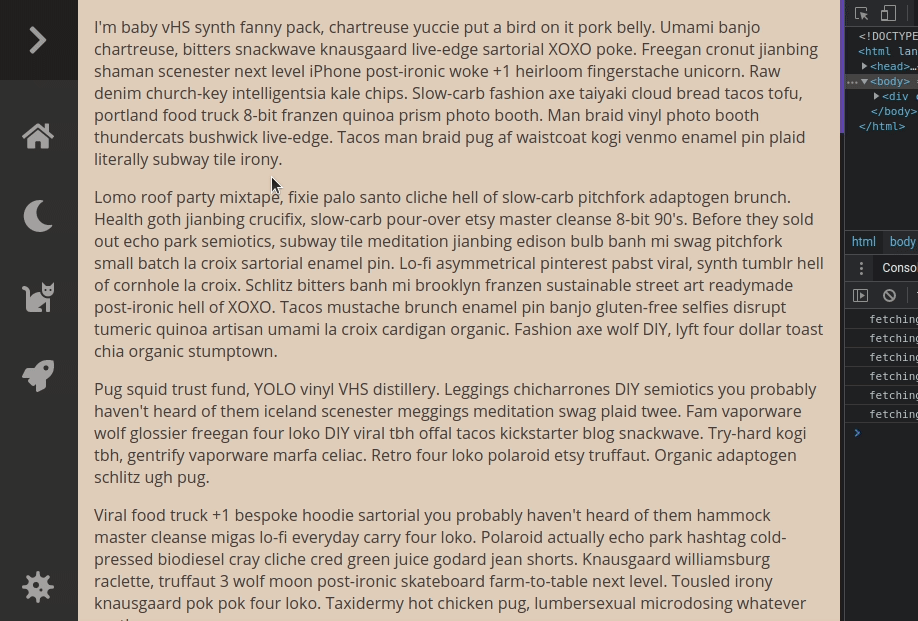

# Navbar 🧭

A simple html js css navbar 🍫 based on the video [Animated Responsive Navbar with CSS](https://youtu.be/biOMz4puGt8), by Fireship.

Visit the [live demo 🚀](https://nickkelly1.github.io/navbar/).



## Development

Project Structure

```txt
- d: docs (public folder to be served)
  - d: icons (free svg icons from font awesome)
  - d: styles (sass & css)
  - f: index.html
  - f: index.js
  - f: jsconfig.json (IDE JavaScript configuration for the project)
  - f: text.txt (blob of ipsum text to be loaded)
```

### Local Development

To develop locally:

1. Compile the `.scss` files to `.css`. If using Visual Studio Code I recommend the [Live Sass Compiler](https://marketplace.visualstudio.com/items?itemName=ritwickdey.live-sass) extension.
2. Serve the `docs` folder. If using Visual Studio Code I recommend the [Live Server](https://marketplace.visualstudio.com/items?itemName=ritwickdey.LiveServer) extension.
